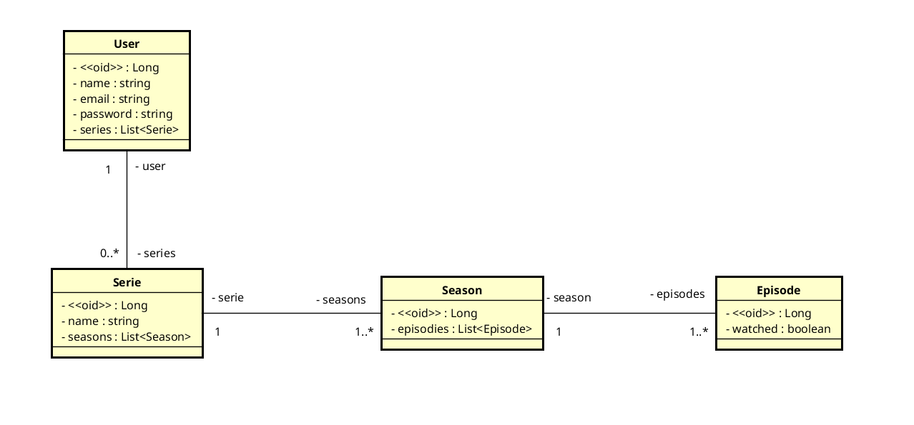

# SeriesTV

[](https://github.com/venzel/series-tv-backend/blob/master/LICENSE)

> Projeto em Java com Spring Boot da disciplina Desenvolvimento de Sistemas para Web, ministrada pelo professor orientador
> Danyllo Wagner pelo IPFB 2021.2.<br />

## Sobre

Aplicação fullstack de um sistema de séries de tv.

<hr />

## Autores

-   Edivam Enéas de Almeida Júnior
-   Joab da Silva Maia

<hr />

### Diagrama de classe



<hr />

### Back-end

-   Api REST Full com arquitetura Feature By Packages
-   Java
-   Spring Boot
-   JPA / Hibernate
-   Autenticação Token JWT

### Front-end

-   Angular 12

👉 [Link para o repositório do front end](https://github.com/venzel/series-tv-frontend)

### Persistência de dados

-   MySQL

### Outras informações

O projeto tem como gerencimento de pacotes o **Maven** e o **Makefile** como automação de comandos, além disso, o mysql é gerenciado através de um container do **Docker**.

## Arquitetura

### Porque Feature by Package?

Feature by Package (FBP) é uma arquitetura que utiliza conceitos do **DDD (Domain Driven Design)**, sugerida por empresas como a **Rocketseat**, com o objetivo de tornar o código mais **flexível**, **escalável** e de **manutenção simples**.

### Vantagens da arquitetura

-   **MANUTENÇÃO**: Facilita o engajamento de muitas equipe e colaboradores em um projeto;
-   **ESCALÁVEL**: Facilita refatoramento do código monolítico para uma uma estrura de microserviços;
-   **SOLID**: Facilita a aplicação de todos os princípios do SOLID;
-   **GIT**: Melhora o gerenciamento dos commits, evitando conflitos e etc;
-   **TESTES**: Facilita o desenvolvimento de testes de unidade e integração.

#### Bibliotecas externas utilizadas

-   <a href="http://modelmapper.org">Model Mapper</a>
-   <a href="https://projectlombok.org">Lombok</a>

<hr />

### Rotas

#### Usuário

-   /users -> Cria um usuário (POST)
-   /auth -> Autenticação de usuário (POST)
-   /auth/refresh -> Atualiza o token jwt (POST)

#### Série

-   /serie_wizard -> Cria uma nova série (POST)
-   /series -> Cria uma nova série (POST)
-   /series -> Lista as séries (GET)
-   /series/{id} -> Exibe uma série (GET)
-   /series/{id} -> Altera uma série (UPDATE)
-   /series/{id} -> Deleta uma série (DELETE)

#### Temporada

-   /season_wizard -> Cria uma nova temporada (POST)
-   /seasons/{id} -> Atualiza temporada (PUT)
-   /seasons/{id} -> Exibe temporada (GET)
-   /seasons/{id} -> Deleta temporada (DELETE)

#### Episódios

-   /episodes/mark?option=1&ids={ids} -> Marca episódio como assistido (GET)
-   /episodes/mark?option=0&ids={ids} -> Marca episódio como não assistido (GET)

<hr />

### Para clonar e rodar o projeto

#### Pré-requisitos

-   Java 11
-   Docker
-   Docker compose

```bash
# Para clonar o repositório
git clone https://github.com/venzel/series-tv-backend

# Para entrar na pasta do projeto
cd series-tv-backend

# Para subir o container do mysql na porta 33064
make up

# Para executar o projeto na porta 8080
make run
```
