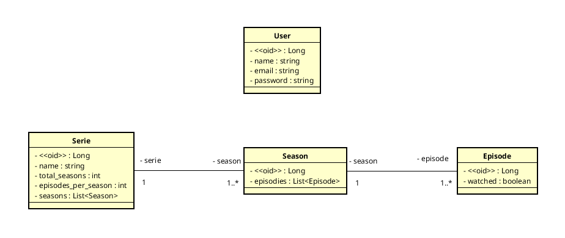

# Series

[](https://github.com/venzel/series/blob/master/LICENSE)

> Projeto em Java com Spring Boot da disciplina Desenvolvimento de Sistemas para Web, ministrada pelo professor orientador
> Danyllo Wagner pelo IPFB 2021.2.<br />

## Sobre

Aplicação back-end e front-end de um sistema de séries de tv.

<hr />

## Autores

-   Edivam Enéas de Almeida Júnior
-   Joab da Silva Maia

<hr />

### Diagrama de classe



<hr />

### Back-end

-   Api REST Full com arquitetura Feature By Packages
-   Java
-   Spring Boot
-   JPA / Hibernate

### Front-end

-   JSF

### Persistência de dados

-   MySQL

### Outras informações

O projeto tem como gerencimento de pacotes o **Maven** e o **Makefile** como automação de comandos, além disso, o mysql é gerenciado através de um container do **Docker**.

#### Bibliotecas externas utilizadas

-   <a href="http://modelmapper.org">Model Mapper</a>
-   <a href="https://projectlombok.org">Lombok</a>

<hr />

### Rotas

#### Usuário

-   /users -> Cria novo usuario (POST)
-   /login -> Acessa a plataforma por autenticação de email e senha (POST)
-   /dashboard -> Painel administrativo (GET)

#### Série

-   /series -> Cria uma nova série (POST)
-   /series -> Lista as séries (GET)
-   /series/{id} -> Exibe uma série (GET)
-   /series/{id} -> Altera uma série (UPDATE)
-   /series/{id} -> Deleta uma série (DELETE)

#### Temporada

-   /seasons -> Lista temporadas (GET)

#### Episódios

-   /episodes -> Lista episódios (GET)
-   /episodes/mark?option={option}&ids={ids} -> Marca como episódio assistido ou não assistido (GET)

<hr />

### Para clonar e rodar o projeto

#### Pré-requisitos

-   Java 11
-   Docker
-   Docker compose

```bash
# Para clonar repositório
git clone https://github.com/venzel/series

# Para entrar na pasta do projeto
cd series

# Para subir o container do mysql na porta 3306
make up

# Para executar o projeto na porta 8080
make run
```
